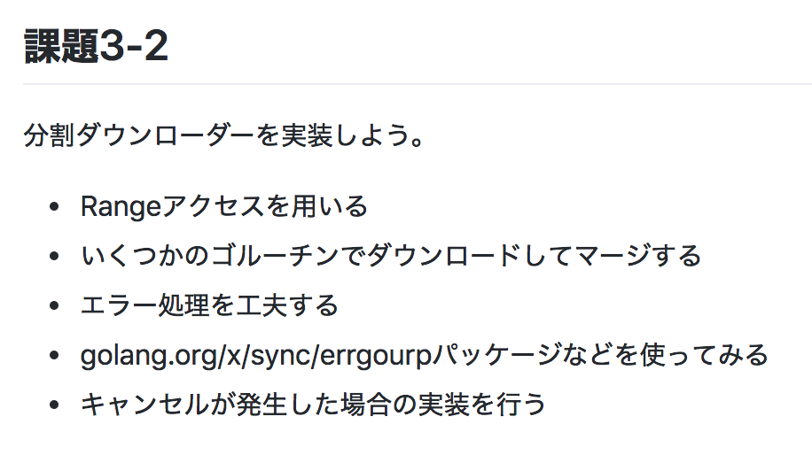

footer: Gopher道場#1 LT大会 2018/05/28 - Yoshima Takatada / @shiimaxx
autoscale: true

## contextによるキャンセル処理

#### Yoshima Takatada / @shiimaxx

---

# About me


- Yoshima Takatada / @shiimaxx
- https://shiimaxx.com
- 株式会社ハートビーツ
    - 技術開発室 エンジニア

---



https://github.com/gopherdojo/dojo1/tree/master/kadai3


---

### 課題3-2 分割ダウンロードを行う

- 🙆 Rangeアクセスを用いる
- 🙆 いくつかのゴルーチンでダウンロードしてマージする
- 🙆 エラー処理を工夫する
- 🙆 golang.org/x/sync/errgourpパッケージなどを使ってみる
- 🙅 キャンセルが発生した場合の実装を行う

---

### キャンセルが発生した場合の実装を行う

```go, [.highlight:1, 13]
	eg, ctx := errgroup.WithContext(context.TODO())
	tempFiles := make([]*os.File, c.Parallel)

	for p := 0; p < c.Parallel; p++ {
		s := p * chunkSize
		e := s + (chunkSize - 1)
		if p == c.Parallel-1 {
			e += surplus
		}

		i := p
		eg.Go(func() error {
			return rangeGet(ctx, url, s, e, i, tempFiles)
		})
	}
```

https://github.com/gopherdojo/dojo1/blob/kadai3-2-shiimaxx/kadai3/shiimaxx/range-access/gurl/gurl.go#L79-L92

---

### キャンセルが発生した場合の実装を行う？

```go
func rangeGet(ctx context.Context, url string, s, e, i int, tempFiles []*os.File) error {
	client := &http.Client{}
	req, err := http.NewRequest("GET", url, nil)
	if err != nil {
		return err
	}
	req.Header.Add("Range", fmt.Sprintf("bytes=%d-%d", s, e))
	resp, err := client.Do(req)
	if err != nil {
		return err
	}
	defer resp.Body.Close()

	reader, err := ioutil.ReadAll(resp.Body)
	if err != nil {
		return err
	}
	tempFile, err := ioutil.TempFile("./", "temp")
	if err != nil {
		return err
	}
	if err := ioutil.WriteFile(tempFile.Name(), reader, 0644); err != nil {
		return err
	}
	tempFiles[i] = tempFile

	return nil
}
```

キャンセル処理がどこにもない……そもそも引数で受け取った`ctx`を使っていない……

https://github.com/gopherdojo/dojo1/blob/kadai3-2-shiimaxx/kadai3/shiimaxx/range-access/gurl/gurl.go#L35-L62

---

### モチベーション

- 課題3-2 分割ダウンロードを実装しよう
    - 🙅 キャンセルが発生した場合の実装を行う
- キャンセル処理 -> contextを使うというイメージはあった
- キャンセル処理においてcontextが何をしてくれるのかをちゃんと理解していなかった
- contextを理解して使えるようになろう

---

### contextの取得

```go
ctx, cancel := context.WithCancel(context.Background())
```

- `func Background() Context`
    - 空コンテキストを返す
	- `emptyCtx`型
- `func WithCancel(parent Context) (ctx Context, cancel CancelFunc)`
    - `Context`インターフェイスを引数にとり、contextとキャンセル用の関数を返す
    - 返されたcontextのdoneチャンネルは、キャンセル用の関数が呼び出されたとき、もしくは親contexのdoneチャンネルがクローズしたときにクローズされる
	- `cancelCtx`型

---

### emptyCtx

```go
// An emptyCtx is never canceled, has no values, and has no deadline. It is not
// struct{}, since vars of this type must have distinct addresses.
type emptyCtx int

func (*emptyCtx) Deadline() (deadline time.Time, ok bool) {
	return
}

func (*emptyCtx) Done() <-chan struct{} {
	return nil
}

func (*emptyCtx) Err() error {
	return nil
}

func (*emptyCtx) Value(key interface{}) interface{} {
	return nil
}
```

- https://github.com/golang/go/blob/release-branch.go1.10/src/context/context.go#L167-L195

---

### cancelCtx

```go
// A cancelCtx can be canceled. When canceled, it also cancels any children
// that implement canceler.
type cancelCtx struct {
	Context

	mu       sync.Mutex            // protects following fields
	done     chan struct{}         // created lazily, closed by first cancel call
	children map[canceler]struct{} // set to nil by the first cancel call
	err      error                 // set to non-nil by the first cancel call
}

func (c *cancelCtx) Done() <-chan struct{} {
	c.mu.Lock()
	if c.done == nil {
		c.done = make(chan struct{})
	}
	d := c.done
	c.mu.Unlock()
	return d
}

func (c *cancelCtx) Err() error {
	c.mu.Lock()
	defer c.mu.Unlock()
	return c.err
}

func (c *cancelCtx) String() string {
	return fmt.Sprintf("%v.WithCancel", c.Context)
}
```

- https://github.com/golang/go/blob/release-branch.go1.10/src/context/context.go#L314-L343

---

### cancelCtx

```go
// cancel closes c.done, cancels each of c's children, and, if
// removeFromParent is true, removes c from its parent's children.
func (c *cancelCtx) cancel(removeFromParent bool, err error) {
	if err == nil {
		panic("context: internal error: missing cancel error")
	}
	c.mu.Lock()
	if c.err != nil {
		c.mu.Unlock()
		return // already canceled
	}
	c.err = err
	if c.done == nil {
		c.done = closedchan
	} else {
		close(c.done)
	}
	for child := range c.children {
		// NOTE: acquiring the child's lock while holding parent's lock.
		child.cancel(false, err)
	}
	c.children = nil
	c.mu.Unlock()

	if removeFromParent {
		removeChild(c.Context, c)
	}
}
```

- https://github.com/golang/go/blob/release-branch.go1.10/src/context/context.go#L345-L372

---

### キャンセルの待機

```go
    // キャンセルを待機
	<-ctx.Done()
```

- `func (c *cancelCtx) Done() <-chan struct{}`
    - `cancelCtx`がフィールドに持つ`done`チャンネルを`make(chan struct{})`で初期化して返す
	- このチャンネルを受信するまでブロックされる

---

### cancelCtx.Done()

```go
func (c *cancelCtx) Done() <-chan struct{} {
	c.mu.Lock()
	if c.done == nil {
		c.done = make(chan struct{})
	}
	d := c.done
	c.mu.Unlock()
	return d
}
```

- `c.done`を`d`に代入したあと、`d`をreturnしている
	- chanは参照型なので参照を返している

- https://github.com/golang/go/blob/release-branch.go1.10/src/context/context.go#L325-L333

---

### キャンセルの実行

```go
	// contextを取得
	ctx, cancel := context.WithCancel(context.Background())
        :

	// キャンセル
	cancel()
```

- `cancel`は`context.WithCancel()`の二つ目の返り値として受け取っている
- `context.WithCancel`の2つめの返り値は `func() { c.cancel(true, Canceled) }`
- `cancelCtx`に実装されている`cancel`メソッドの実装を見る

---

### cancelCtx.cancel()

```go
	if c.done == nil {
		c.done = closedchan
	} else {
		close(c.done)
	}
	for child := range c.children {
		// NOTE: acquiring the child's lock while holding parent's lock.
		child.cancel(false, err)
	}
```

- `c.done == nil`ではない場合、`c.done`がクローズされる
	- `c.done`をクローズすると`<- ctx.Done()`で待機していた箇所で受信する
	- つまりチャンネルをクローズすることでキャンセルを通知している
- 自身の子context(`c.children`)もクローズしている

https://github.com/golang/go/blob/release-branch.go1.10/src/context/context.go#L357-L365

---

### context

- contextはキャンセルの伝搬を行う
- キャンセルに伴う処理の中断、リソース開放などは適切に実装する必要がある

---

### 課題3-2 分割ダウンロードを行う

- 🙆 Rangeアクセスを用いる
- 🙆 いくつかのゴルーチンでダウンロードしてマージする
- 🙆 エラー処理を工夫する
- 🙆 golang.org/x/sync/errgourpパッケージなどを使ってみる
- 🙅 **キャンセルが発生した場合の実装を行う**

---

### キャンセルが発生した場合の実装を行う

- 分割ダウンロードのため複数のgoroutineを起動してHTTPリクエストを実行する
- HTTPリクエストで1つでもエラーが発生した場合は他のすべてのリクエストをキャンセルする
- golang.org/x/sync/errgourpを使う

---

### golang.org/x/sync/errgourp

- `func WithContext(ctx context.Context) (*Group, context.Context)`
	- キャンセル用の関数を`cancel`フィールドに指定した`Group`構造体のアドレスとcontextを返す
	- contextは`context.WithCancel()`で取得している
		- キャンセルが実行できる
- `func (g *Group) Go(f func() error)`
    - 引数に渡した関数がエラーを返した場合に自身の`cancel`フィールドにもつキャンセル用の関数を実行する
	- つまり明示的に`cancel()`を呼び出す必要はない
- `Go`メソッドで実行する関数内でキャンセル通知を受け取れるようにする必要がある

https://github.com/golang/sync/blob/master/errgroup/errgroup.go

---

### キャンセルが発生した場合の実装を行う

```go
func rangeGet(ctx context.Context, url string, s, e, i int, tempFiles []*os.File) error {
	client := &http.Client{}
	req, err := http.NewRequest("GET", url, nil)
	if err != nil {
		return err
	}
	req.Header.Add("Range", fmt.Sprintf("bytes=%d-%d", s, e))
	req.WithContext(ctx)
	resp, err := client.Do(req)
	if err != nil {
		return err
	}
		:

func (c *Client) Get(url string) error {
		:
	eg, ctx := errgroup.WithContext(context.Background())
	tempFiles := make([]*os.File, c.Parallel)
		:
		eg.Go(func() error {
			return rangeGet(ctx, url, s, e, i, tempFiles)
		})
	}
		:
```

---

### キャンセルが発生した場合の実装を行う

- 自分の場合、`Get()`の`eg.Go()`で呼び出す`rangeGet()`内でHTTPリクエストを実行する実装になっている
- 標準ライブラリのnet/httpでは、`http.Request`に`WithContext()`メソッドでcontextを渡すことができる
- `rangeGet()`に渡したcontextを`req.WithContext(ctx)`でリクエストに紐付けることでキャンセルを受信できるようにした

---

# まとめ

- contextはキャンセルの伝搬を行う
- キャンセルに伴う処理の中断、リソース開放などは適切に実装する必要がある
	- `<- ctx.Done()`で受信した場合の処理を書く
	- ライブラリがcontextをサポートしている場合はそれを利用する
- 奥が深そうなのでまだまだこれから
